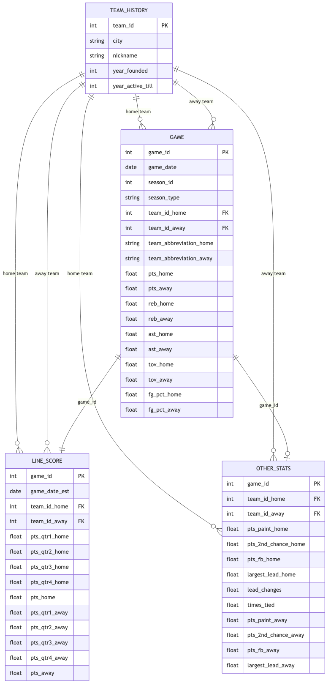

# DS 4320 Project 1: Predicting NBA Game Outcomes with Team Performance Data

## Executive Summary

This repository contains my DS 4320 Project 1. The goal of this project is to build a relational secondary dataset and use it to study whether team performance statistics can predict NBA game outcomes. The repository includes the project writeup, background readings, dataset documentation, a press release, and a proof-of-concept pipeline built with Python, SQL, and DuckDB.

## Name

Ben Garozzo

## NetID

huk5pd

## DOI

## Press Release

[Press Release](./press_release.md)

## Data

[Data Folder](./data)

## Pipeline

[Pipeline Folder](./pipeline)

## License

[MIT License](./LICENSE)

---

## Problem Definition

### Initial General Problem and Refined Specific Problem

**Initial General Problem:** Predicting sports game outcomes.

**Refined Specific Problem:** Can team offensive and defensive statistics from prior games be used to predict whether the home team will win an NBA game?

### Rationale for Refinement

The general problem of predicting sports game outcomes is too broad because it applies to many sports, leagues, and prediction goals. I refined the problem to NBA games and predicting the winner of each game because the data are structured, widely available, and naturally relational. This makes the problem specific, testable, and appropriate for a relational data project.

### Motivation for the Project

NBA teams, analysts, and fans increasingly rely on data to understand performance and decision-making. Statistics such as scoring, shooting efficiency, rebounds, and turnovers provide insight into team strength. This project is motivated by the idea that recent team performance can be used to estimate win probability in a way that is both useful and interpretable.

### Headline of Press Release and Link

**Headline:** Can Basketball Data Predict Who Wins the Game?

[Read the Press Release](./press_release.md)

---

## Domain Exposition

### Terminology

| Term | Definition |
|-----|----------|
| Offensive Rating | Estimated points scored per 100 possessions |
| Defensive Rating | Estimated points allowed per 100 possessions |
| Possession | A period when a team controls the ball |
| Field Goal Percentage | Share of shots made |
| Rebounds | Gaining possession after a missed shot |
| Assists | Passes leading directly to a basket |
| Turnovers | Loss of possession |
| Sports Analytics | Use of data to analyze performance |

### Domain Explanation

This project lives in the domain of sports analytics. In basketball, analysts use structured game data to understand why teams win or lose and to evaluate performance trends. NBA data are well suited for this because they include both outcomes and performance metrics at the game level. This project uses those statistics to study whether recent team performance can predict game outcomes.

### Background Reading

See the [background_reading](./background_reading) folder.

### Reading Summary Table

| Title | Brief Description | Link |
|---|---|---|
| Hybrid Basketball Game Outcome Prediction Model | Applies machine learning techniques to NBA data to predict game outcomes. | [Paper](./background_reading/paper1_hybrid_model.pdf) |
| GCN + Random Forest Basketball Prediction | Combines graph neural networks and random forests to improve prediction accuracy. | [Paper](./background_reading/paper2_gcn_rf.pdf) |
| Predicting the Winning Team in Basketball | Explores statistical patterns in basketball data to predict winners. | [Paper](./background_reading/paper3_novel_approach.pdf) |
| XGBoost + SHAP NBA Prediction | Uses XGBoost and SHAP to explain key drivers of winning. | [Paper](./background_reading/paper4_xgboost_shap.pdf) |
| Basketball Reference Four Factors | Explains key metrics influencing winning. | [Paper](./background_reading/paper5_four_factors.pdf) |

---

## Data Creation

### Provenance

The dataset was created using the public Kaggle basketball dataset. The following tables were selected: game, line_score, team_history, and other_stats. These tables were chosen because they contain game outcomes, team identifiers, and performance statistics needed for modeling.

### Code Table

| File | Description | Link |
|-----|------------|------|
| create_project_data.ipynb | Loads and cleans raw data | [Link](./pipeline/create_project_data.ipynb) |
| create_project_data.md | Markdown export of data creation | [Link](./pipeline/create_project_data.md) |
| nba_pipeline.ipynb | Builds features and model | [Link](./pipeline/nba_pipeline.ipynb) |
| nba_pipeline.md | Markdown export of pipeline | [Link](./pipeline/nba_pipeline.md) |

### Bias Identification

Bias may be introduced because the dataset excludes contextual factors such as injuries, travel, rest, and coaching strategy. It also reflects historical changes in play style across seasons.

### Bias Mitigation

Bias is partially mitigated by using multiple seasons of data, including multiple performance metrics, and explicitly framing predictions as conditional on available statistics rather than full game context.

### Rationale for Critical Decisions

The dataset was limited to a small number of relational tables to maintain clarity while still supporting meaningful analysis. Team-level modeling was chosen instead of player-level modeling to reduce complexity. Rolling averages were used to avoid data leakage and better reflect real-world prediction conditions.

---

## Metadata

### Schema

The dataset follows a relational structure:

- game is the central table  
- line_score joins via game_id  
- other_stats joins via game_id  
- team_history joins via team_id  

Primary keys:
- game: game_id  
- team_history: team_id  

Foreign keys:
- game → team_history (team_id_home, team_id_away)  
- line_score → game (game_id)  
- other_stats → game (game_id)  

---

## Data

**UVA OneDrive Link:**  
https://myuva-my.sharepoint.com/:f:/g/personal/huk5pd_virginia_edu/IgDKG8Q2YxHmQJ1Ainn6krPOAW7eg6799hKzGlpeC4XWkjI?e=6En401

### Data Table

| Table | Description | Link |
|------|------------|------|
| game | Game-level stats | [Link](./data/game.csv) |
| line_score | Quarter scoring | [Link](./data/line_score.csv) |
| team_history | Team metadata | [Link](./data/team_history.csv) |
| other_stats | Additional stats | [Link](./data/other_stats.csv) |

---

### Data Dictionary

| Feature | Data Type | Description | Example |
|--------|----------|------------|--------|
| game_id | integer | Unique identifier for each NBA game | 48000053 |
| game_date | date | Date the game was played | 1981-05-14 |
| team_id_home | integer | Unique ID for the home team | 1610612745 |
| team_id_away | integer | Unique ID for the away team | 1610612738 |
| team_abbreviation_home | string | Abbreviation of home team | HOU |
| team_abbreviation_away | string | Abbreviation of away team | BOS |
| pts_home | float | Points scored by home team | 91.0 |
| pts_away | float | Points scored by away team | 102.0 |

| avg_pts_home | float | Rolling average points scored by home team (last 10 games) | 89.4 |
| avg_reb_home | float | Rolling average rebounds by home team | 43.0 |
| avg_ast_home | float | Rolling average assists by home team | 22.2 |
| avg_tov_home | float | Rolling average turnovers by home team | 17.6 |
| avg_fg_pct_home | float | Rolling average field goal percentage (home team) | 0.458 |
| avg_fg3_pct_home | float | Rolling average three-point percentage (home team) | 0.2666 |
| avg_ft_pct_home | float | Rolling average free throw percentage (home team) | 0.7158 |

| avg_pts_away | float | Rolling average points scored by away team (last 10 games) | 98.4 |
| avg_reb_away | float | Rolling average rebounds by away team | 49.4 |
| avg_ast_away | float | Rolling average assists by away team | 22.2 |
| avg_tov_away | float | Rolling average turnovers by away team | 17.6 |
| avg_fg_pct_away | float | Rolling average field goal percentage (away team) | 0.458 |
| avg_fg3_pct_away | float | Rolling average three-point percentage (away team) | 0.1334 |
| avg_ft_pct_away | float | Rolling average free throw percentage (away team) | 0.7237 |

| home_win | binary | Target variable: 1 if home team wins, 0 otherwise | 0 |

---

### Numerical Uncertainty

| Feature | Mean | Std Dev | Min | Max |
|--------|------|--------|-----|-----|
| pts_home | 103.79 | 13.61 | 36.0 | 175.0 |
| pts_away | 100.46 | 13.29 | 33.0 | 184.0 |
| avg_pts_home | 102.06 | 8.21 | 74.8 | 162.6 |
| avg_pts_away | 102.19 | 8.25 | 74.4 | 155.4 |
| avg_fg_pct_home | 0.460 | 0.026 | 0.363 | 0.559 |
| avg_fg_pct_away | 0.460 | 0.026 | 0.363 | 0.564 |
| avg_reb_home | 42.67 | 2.97 | 31.1 | 55.4 |
| avg_reb_away | 42.74 | 2.98 | 31.7 | 54.8 |

---

## Pipeline Check

The pipeline was tested end-to-end:

- Data loaded successfully  
- SQL queries validated joins  
- Modeling dataset created using rolling averages  
- Logistic regression model trained  

Results:
- Accuracy: 62.4%  
- Confusion Matrix:  
  - TP: 4874  
  - TN: 939  
  - FP: 2760  
  - FN: 743  

This confirms the pipeline runs correctly and produces meaningful outputs.